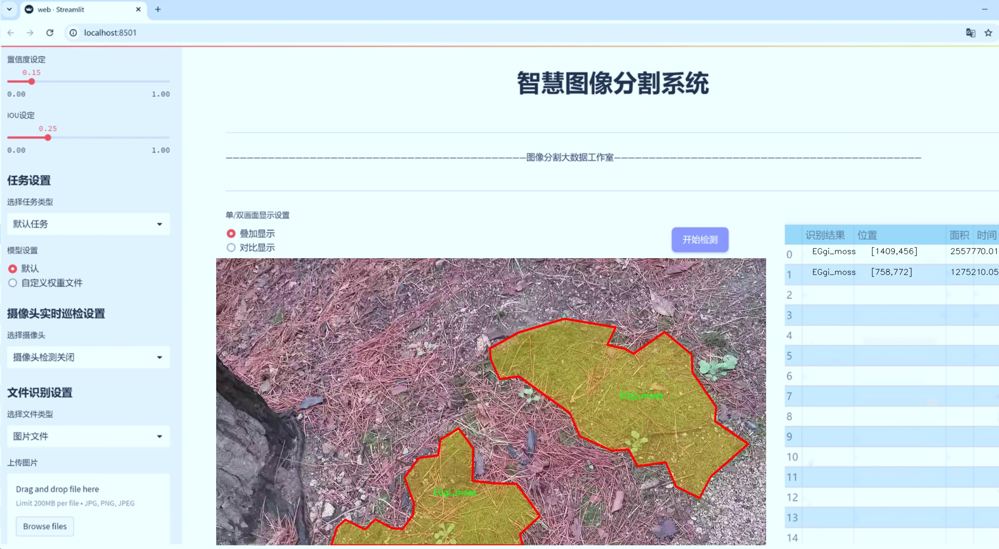
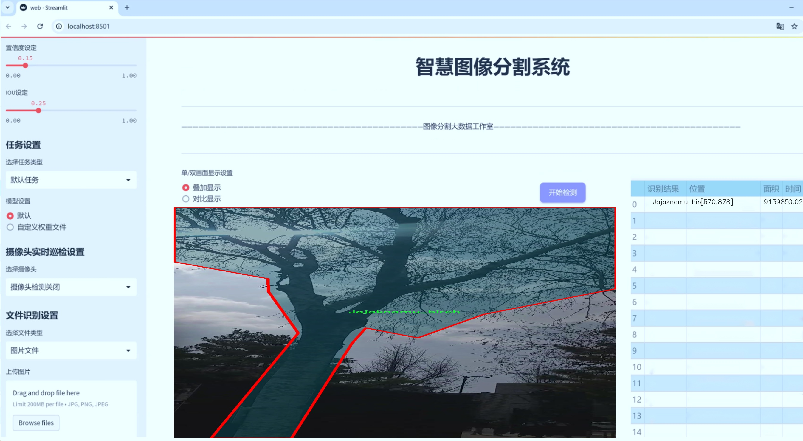
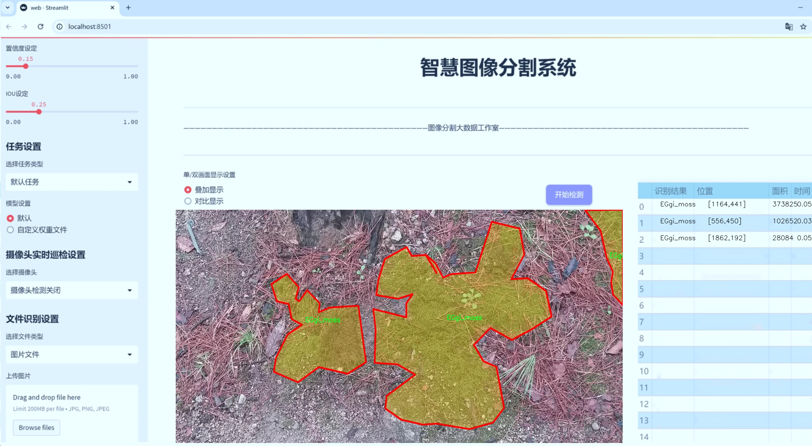
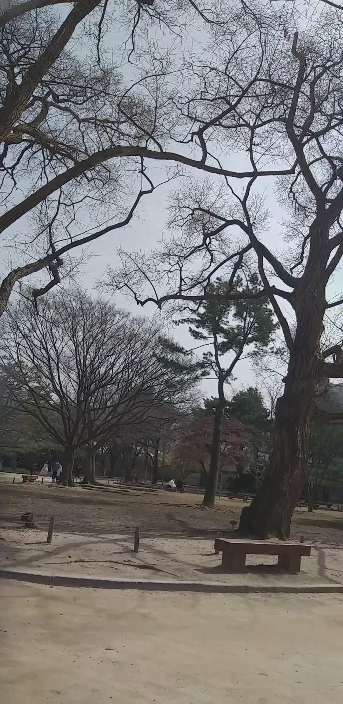
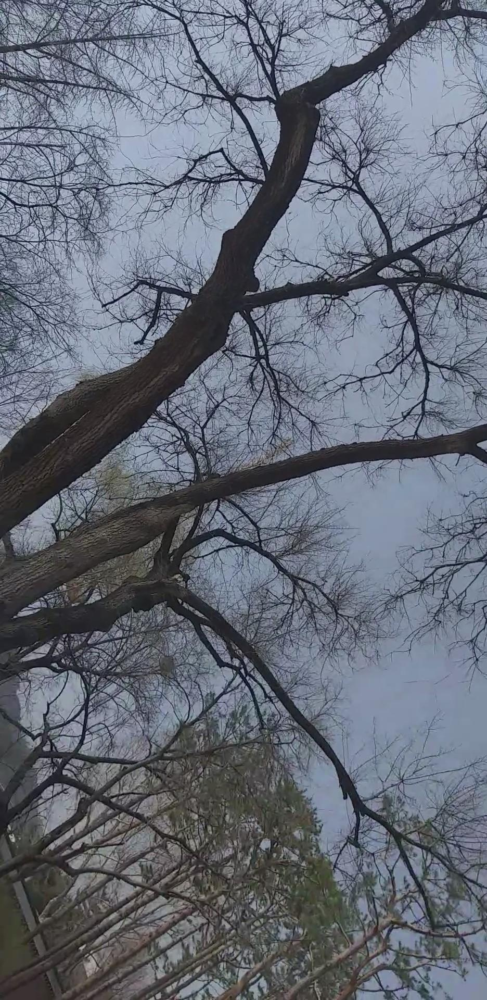
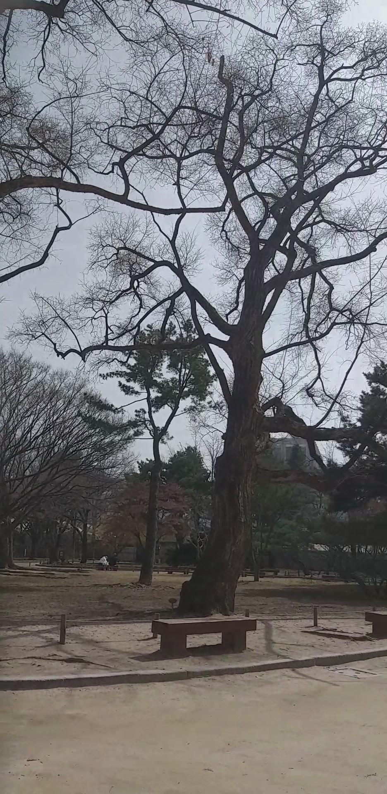

# 传统韩文化元素分割系统： yolov8-seg-GFPN

### 1.研究背景与意义

[参考博客](https://gitee.com/YOLOv8_YOLOv11_Segmentation_Studio/projects)

[博客来源](https://kdocs.cn/l/cszuIiCKVNis)

研究背景与意义

随着全球化的加速，传统文化的保护与传承面临着前所未有的挑战。尤其是韩国的传统文化，作为东亚文化的重要组成部分，蕴含着丰富的历史、艺术和哲学内涵。然而，随着现代化进程的推进，许多传统文化元素逐渐被边缘化，亟需通过科技手段进行有效的保护与传播。在此背景下，基于改进YOLOv8的传统韩文化元素分割系统的研究显得尤为重要。

YOLO（You Only Look Once）系列模型以其高效的目标检测能力在计算机视觉领域取得了显著成就。YOLOv8作为该系列的最新版本，结合了深度学习的先进技术，能够在复杂环境中快速、准确地识别和分割图像中的目标。通过对YOLOv8的改进，我们可以更好地适应传统韩文化元素的多样性和复杂性，从而实现对这些元素的精准识别与分类。研究表明，传统文化元素的视觉特征往往具有独特性和多样性，例如，韩国传统服饰“韩服”、传统建筑、民间信仰等，均可通过图像识别技术进行有效的提取与分析。

本研究所使用的数据集包含2100幅图像，涵盖63个类别，涉及到的传统韩文化元素包括但不限于“韩服”、“传统宫殿”、“丹青”等。这些元素不仅是韩国文化的象征，也是其历史和社会发展的重要见证。通过对这些元素的分割与识别，研究者能够深入分析其在当代社会中的表现与变迁，进而为传统文化的保护与传播提供数据支持。

此外，基于改进YOLOv8的分割系统还具有重要的应用价值。通过对传统韩文化元素的精准识别，相关机构和组织可以更有效地进行文化遗产的数字化保存与展示，促进公众对传统文化的认知与理解。例如，在博物馆展览、文化活动以及教育领域，该系统可以帮助观众更直观地了解传统文化的内涵与价值。同时，该系统的开发也为其他国家和地区的传统文化保护提供了借鉴，推动了全球范围内的文化交流与合作。

综上所述，基于改进YOLOv8的传统韩文化元素分割系统的研究，不仅为传统文化的保护与传承提供了新的技术手段，也为相关领域的研究提供了丰富的数据支持与理论基础。通过这一研究，我们期望能够激发更多人对传统文化的关注与热爱，促进文化的多样性与可持续发展，为构建和谐社会贡献力量。

### 2.图片演示







注意：本项目提供完整的训练源码数据集和训练教程,由于此博客编辑较早,暂不提供权重文件（best.pt）,需要按照6.训练教程进行训练后实现上图效果。

### 3.视频演示

[3.1 视频演示](https://www.bilibili.com/video/BV1fuzUYBEEk/)

### 4.数据集信息

##### 4.1 数据集类别数＆类别名

nc: 24
names: ['-HalmiGgot_a grandmother flower', 'Buknamu', 'Ccachi_magpie', 'ChulZzuk_Royal azalea', 'Dancheong in the Korean Palace', 'Dungnamu', 'EGgi_moss', 'Ganari', 'Jaebi_violet', 'Jajaknamu_birch', 'JindalRae_azalea', 'Korean Traditional Hanbok', 'Korean folk beliefs', 'Korean traditional palace', 'KoreanLee', 'Mindulrae_dandelion', 'MokRyun_magnolia', 'Pigeon', 'SAEZIP', 'SalguGgot_apricot', 'Sansuyou', 'Sonamu_Pine', 'Whasalnamu', 'Wheyangmok']


##### 4.2 数据集信息简介

数据集信息展示

在现代计算机视觉领域，数据集的构建与应用是实现高效模型训练的基础。本研究所使用的数据集名为“sae_0309”，其主要目的是为改进YOLOv8-seg的传统韩文化元素分割系统提供丰富的训练数据。该数据集包含24个类别，涵盖了多种与韩国传统文化密切相关的元素，体现了深厚的文化底蕴和自然生态的多样性。

数据集中的类别列表包括了多种植物、动物以及传统服饰等元素，具体类别如下：-HalmiGgot（奶奶花）、Buknamu（北南木）、Ccachi（喜鹊）、ChulZzuk（皇家杜鹃）、Dancheong（韩国宫殿的彩绘）、Dungnamu（东南木）、EGgi（苔藓）、Ganari（甘栗）、Jaebi（紫罗兰）、Jajaknamu（桦树）、JindalRae（杜鹃花）、Korean Traditional Hanbok（韩国传统韩服）、Korean folk beliefs（韩国民间信仰）、Korean traditional palace（韩国传统宫殿）、KoreanLee（韩国李树）、Mindulrae（蒲公英）、MokRyun（木兰）、Pigeon（鸽子）、SAEZIP（塞子）、SalguGgot（杏花）、Sansuyou（山茱萸）、Sonamu（松树）、Whasalnamu（花梨木）、Wheyangmok（红枫）。这些类别不仅涵盖了自然界的植物和动物，还融入了丰富的文化元素，体现了韩国传统文化的独特魅力。

“sae_0309”数据集的构建过程注重数据的多样性和代表性，确保每个类别都有足够的样本，以便模型能够学习到更为细致的特征。这种多样性不仅体现在样本的数量上，还体现在样本的质量上。每个类别的图像均经过精心挑选，确保其在光照、角度和背景等方面的多样性，以提高模型的泛化能力。此外，数据集中的图像还经过标注，确保每个元素的边界清晰可辨，从而为分割任务提供准确的训练数据。

在数据集的应用方面，研究者可以利用“sae_0309”进行YOLOv8-seg模型的训练，以实现对传统韩文化元素的高效分割。这一过程不仅有助于提升模型的分割精度，还能为后续的文化遗产保护、数字化展示等应用提供技术支持。通过对这些传统元素的精确分割，研究者能够更好地分析和理解韩国文化的多样性与复杂性，从而为文化传承与创新提供新的视角。

总之，“sae_0309”数据集不仅是一个用于训练YOLOv8-seg模型的工具，更是一个承载着韩国传统文化和自然生态的丰富资源。通过对这一数据集的深入研究与应用，研究者能够在推动计算机视觉技术发展的同时，助力传统文化的保护与传播，为实现文化的可持续发展贡献力量。









### 5.项目依赖环境部署教程（零基础手把手教学）

[5.1 环境部署教程链接（零基础手把手教学）](https://www.bilibili.com/video/BV1jG4Ve4E9t/?vd_source=bc9aec86d164b67a7004b996143742dc)


[5.2 安装Python虚拟环境创建和依赖库安装视频教程链接（零基础手把手教学）](https://www.bilibili.com/video/BV1nA4VeYEze/?vd_source=bc9aec86d164b67a7004b996143742dc)

### 6.手把手YOLOV8-seg训练视频教程（零基础手把手教学）

[6.1 手把手YOLOV8-seg训练视频教程（零基础小白有手就能学会）](https://www.bilibili.com/video/BV1cA4VeYETe/?vd_source=bc9aec86d164b67a7004b996143742dc)


按照上面的训练视频教程链接加载项目提供的数据集，运行train.py即可开始训练



     Epoch   gpu_mem       box       obj       cls    labels  img_size
     1/200     0G   0.01576   0.01955  0.007536        22      1280: 100%|██████████| 849/849 [14:42<00:00,  1.04s/it]
               Class     Images     Labels          P          R     mAP@.5 mAP@.5:.95: 100%|██████████| 213/213 [01:14<00:00,  2.87it/s]
                 all       3395      17314      0.994      0.957      0.0957      0.0843

     Epoch   gpu_mem       box       obj       cls    labels  img_size
     2/200     0G   0.01578   0.01923  0.007006        22      1280: 100%|██████████| 849/849 [14:44<00:00,  1.04s/it]
               Class     Images     Labels          P          R     mAP@.5 mAP@.5:.95: 100%|██████████| 213/213 [01:12<00:00,  2.95it/s]
                 all       3395      17314      0.996      0.956      0.0957      0.0845

     Epoch   gpu_mem       box       obj       cls    labels  img_size
     3/200     0G   0.01561    0.0191  0.006895        27      1280: 100%|██████████| 849/849 [10:56<00:00,  1.29it/s]
               Class     Images     Labels          P          R     mAP@.5 mAP@.5:.95: 100%|███████   | 187/213 [00:52<00:00,  4.04it/s]
                 all       3395      17314      0.996      0.957      0.0957      0.0845


### 7.50+种全套YOLOV8-seg创新点加载调参实验视频教程（一键加载写好的改进模型的配置文件）

[7.1 50+种全套YOLOV8-seg创新点加载调参实验视频教程（一键加载写好的改进模型的配置文件）](https://www.bilibili.com/video/BV1Hw4VePEXv/?vd_source=bc9aec86d164b67a7004b996143742dc)

### YOLOV8-seg算法简介

原始YOLOV8-seg算法原理

YOLOv8-seg算法是YOLO系列中的最新版本，专注于目标检测与分割任务，结合了高效的特征提取和深度学习技术，以实现更高的精度和速度。该算法的设计理念源于对前几代YOLO模型的深入分析与改进，尤其是在特征提取、特征融合和损失计算等方面的创新，使其在处理复杂图像数据时表现出色。

首先，YOLOv8-seg算法的骨干网络采用了跨级结构（Cross Stage Partial, CSP），这一设计使得网络在特征提取过程中能够有效地减轻梯度消失的问题。CSP结构通过将特征图分为多个部分并在不同层之间进行交互，增强了模型的表达能力和训练效率。在YOLOv8中，C3模块经过优化，替换为更轻量的结构，旨在减少计算复杂度，同时保持高效的特征提取能力。这种轻量化的设计不仅提高了模型的推理速度，也使得其在资源受限的环境中得以应用。

在特征提取之后，YOLOv8-seg利用空间金字塔池化（SPP）模块，进一步增强了对多尺度特征的处理能力。SPP模块通过在不同尺度上进行池化操作，使得网络能够捕捉到更丰富的上下文信息，从而提高了目标检测的准确性。此外，YOLOv8-seg还引入了特征金字塔网络（FPN）和路径聚合网络（PAN）结构，以实现不同尺度特征的有效融合。这种融合策略确保了网络在处理不同大小目标时，能够灵活地调整特征图的表达，进而提升检测性能。

YOLOv8-seg的头部结构采用了解耦的检测头，分别计算回归和分类损失。这一设计理念使得模型在目标检测时，能够更精确地进行边界框的回归和类别的预测。具体而言，YOLOv8-seg在损失计算上采用了新的策略，包括变焦损失、数据平均保真度损失和完美交并比损失。这些损失函数的引入，使得模型在训练过程中能够更好地优化目标检测的精度，尤其是在复杂场景下的表现得到了显著提升。

值得一提的是，YOLOv8-seg在样本匹配方式上进行了创新，结合了注意力机制，以进一步提高目标检测的准确性。通过引入注意力机制，模型能够在特征图中自动聚焦于重要区域，从而有效地抑制背景噪声对检测结果的干扰。这一机制的应用，使得YOLOv8-seg在面对复杂背景或遮挡物时，依然能够保持较高的检测精度。

在实际应用中，YOLOv8-seg能够处理多种自定义数据集，具备良好的适应性和灵活性。其设计的灵活性使得研究人员和开发者能够根据具体任务的需求，调整模型的深度、宽度及通道数等参数，以达到最佳的性能表现。这种模块化的设计思路，不仅提升了模型的可用性，也为后续的研究与应用提供了广阔的空间。

此外，YOLOv8-seg的训练过程同样得益于其高效的网络结构。通过批归一化和SiLU激活函数的应用，模型在训练过程中能够更快地收敛，减少了过拟合的风险。每个卷积层的设计都经过精心调整，以确保在特征提取和信息传递的过程中，能够最大限度地保留重要信息。这种高效的训练策略，使得YOLOv8-seg在多种应用场景中，均能展现出卓越的性能。

总的来说，YOLOv8-seg算法在目标检测与分割领域的成功，源于其在骨干网络、特征融合、损失计算及样本匹配等多个方面的创新与优化。通过这些改进，YOLOv8-seg不仅提升了检测精度和速度，也为后续的研究与应用提供了强有力的支持。随着深度学习技术的不断发展，YOLOv8-seg有望在更多实际应用中发挥重要作用，推动目标检测与分割技术的进一步进步。


### 9.系统功能展示（检测对象为举例，实际内容以本项目数据集为准）

图9.1.系统支持检测结果表格显示

  图9.2.系统支持置信度和IOU阈值手动调节

  图9.3.系统支持自定义加载权重文件best.pt(需要你通过步骤5中训练获得)

  图9.4.系统支持摄像头实时识别

  图9.5.系统支持图片识别

  图9.6.系统支持视频识别

  图9.7.系统支持识别结果文件自动保存

  图9.8.系统支持Excel导出检测结果数据


### 10.50+种全套YOLOV8-seg创新点原理讲解（非科班也可以轻松写刊发刊，V11版本正在科研待更新）

#### 10.1 由于篇幅限制，每个创新点的具体原理讲解就不一一展开，具体见下列网址中的创新点对应子项目的技术原理博客网址【Blog】：


[10.1 50+种全套YOLOV8-seg创新点原理讲解链接](https://gitee.com/qunmasj/good)

#### 10.2 部分改进模块原理讲解(完整的改进原理见上图和技术博客链接)【如果此小节的图加载失败可以通过CSDN或者Github搜索该博客的标题访问原始博客，原始博客图片显示正常】
### 可变性卷积DCN简介
卷积神经网络由于其构建模块中固定的几何结构，本质上受限于模型几何变换。为了提高卷积神经网络的转换建模能力，《Deformable Convolutional Networks》作者提出了两个模块：可变形卷积（deformable convolution）和可变形RoI池（deformable RoI pooling）。这两个模块均基于用额外的偏移来增加模块中的空间采样位置以及从目标任务中学习偏移的思想，而不需要额外的监督。

第一次证明了在深度神经网络中学习密集空间变换（dense spatial transformation）对于复杂的视觉任务是有效的

视觉识别中的一个关键挑战是如何适应对象比例、姿态、视点和零件变形中的几何变化或模型几何变换。一般有两种方法实现：
1）建立具有足够期望变化的训练数据集。这通常通过增加现有的数据样本来实现，例如通过仿射变换。但是训练成本昂贵而且模型参数庞大。
2）使用变换不变（transformation-invariant）的特征和算法。比如比较有名的SIFT(尺度不变特征变换)便是这一类的代表算法。

但以上的方法有两个缺点：
1）几何变换被假定为固定的和已知的，这些先验知识被用来扩充数据，设计特征和算法。为此，这个假设阻止了对具有未知几何变换的新任务的推广，从而导致这些几何变换可能没有被正确建模。
2）对于不变特征和算法进行手动设计，对于过于复杂的变换可能是困难的或不可行的。

卷积神经网络本质上局限于模拟大型未知转换。局限性源于CNN模块的固定几何结构：卷积单元在固定位置对输入特征图进行采样；池化层以固定比率降低特征矩阵分辨率；RoI（感兴趣区域）池化层将RoI分成固定的空间箱（spatial bins）等。缺乏处理几何变换的内部机制。

这种内部机制的缺乏会导致一些问题，举个例子。同一个CNN层中所有激活单元的感受野大小是相同的，但是这是不可取的。因为不同的位置可能对应于具有不同尺度或变形的对象，所以尺度或感受野大小的自适应确定对于具有精细定位的视觉识别是渴望的。

对于这些问题，作者提出了两个模块提高CNNs对几何变换建模的能力。


deformable convolution（可变形卷积）
将2D偏移量添加到标准卷积中的常规网格采样位置，使得采样网格能够自由变形。通过额外的卷积层，从前面的特征映射中学习偏移。因此，变形采用局部、密集和自适应的方式取决于输入特征。


deformable RoI pooling（可变形RoI池化）
为先前RoI池化的常规库（bin）分区中的每个库位置（bin partition）增加了一个偏移量。类似地，偏移是从前面的特征图和感兴趣区域中学习的，从而能够对具有不同形状的对象进行自适应部件定位（adaptive part localization）。

#### Deformable Convolutional Networks
Deformable Convolution
2D卷积由两个步骤组成：
1）在输入特征图x xx上使用规则网格R RR进行采样。
2）把这些采样点乘不同权重w ww后相加。

网格R定义感受野大小和扩张程度，比如内核大小为3x3，扩张程度为1的网格R可以表示为：
R = { ( − 1 , − 1 ) , ( − 1 , 0 ) , … , ( 0 , 1 ) , ( 1 , 1 ) } R = \{(-1,-1),(-1,0),\dots,(0,1),(1,1)\}
R={(−1,−1),(−1,0),…,(0,1),(1,1)}

​
 一般为小数，使用双线性插值进行处理。（把小数坐标分解到相邻的四个整数坐标点来计算结果）


具体操作如图所示：


首先对输入特征层进行一个普通的3x3卷积处理得到偏移域（offset field）。偏移域特征图具有与输入特征图相同的空间分辨率，channels维度2N对应于N个2D（xy两个方向）偏移。其中的N是原输入特征图上所具有的N个channels，也就是输入输出channels保持不变，这里xy两个channels分别对输出特征图上的一个channels进行偏移。确定采样点后就通过与相对应的权重w点乘相加得到输出特征图上该点最终值。

前面也提到过，由于这里xy两个方向所训练出来的偏移量一般来说是一个小数，那么为了得到这个点所对应的数值，会采用双线性插值的方法，从最近的四个邻近坐标点中计算得到该偏移点的数值，公式如下：


具体推理过程见：双线性插值原理

#### Deformable RoI Poolingb
所有基于区域提议（RPN）的对象检测方法都使用RoI池话处理，将任意大小的输入矩形区域转换为固定大小的特征图。


 一般为小数，需要使用双线性插值进行处理。


具体操作如图所示：


当时看这个部分的时候觉得有些突兀，明明RoI池化会将特征层转化为固定尺寸的区域。其实，我个人觉得，这个部分与上述的可变性卷积操作是类似的。这里同样是使用了一个普通的RoI池化操作，进行一些列处理后得到了一个偏移域特征图，然后重新作用于原来的w × H w \times Hw×H的RoI。只不过这里不再是规律的逐行逐列对每个格子进行池化，而是对于格子进行偏移后再池化处理。

#### Postion﹣Sensitive RoI Pooling
除此之外，论文还提出一种PS RoI池化（Postion﹣Sensitive RoI Pooling）。不同于上述可变形RoI池化中的全连接过程，这里使用全卷积替换。

具体操作如图所示：


首先，对于原来的特征图来说，原本是将输入特征图上的RoI区域分成k × k k\times kk×k个bin。而在这里，则是将输入特征图进行卷积操作，分别得到一个channels为k 2 ( C + 1 ) k^{2}(C+1)k (C+1)的得分图（score maps）和一个channels为2 k 2 ( C + 1 ) 2k{2}(C+1)2k 2 (C+1)的偏移域（offset fields），这两个特征矩阵的宽高是与输入特征矩阵相同的。其中，得分图的channels中，k × k k \times kk×k分别表示的是每一个网格，C CC表示的检测对象的类别数目，1表示背景。而在偏移域中的2表示xy两个方向的偏移。
也就是说，在PS RoI池化中，对于RoI的每一个网格都独自占一个通道形成一层得分图，然后其对于的偏移量占两个通道。offset fields得到的偏移是归一化后的偏移，需要通过和deformable RoI pooling中一样的变换方式得到∆ p i j ∆p_{ij}∆p ij，然后对每层得分图进行偏移池化处理。最后处理完的结果就对应着最后输出的一个网格。所以其包含了位置信息。

原文论述为：


#### Understanding Deformable ConvNets
当可变形卷积叠加时，复合变形的效果是深远的。如图所示：


ps：a是标准卷积的固定感受野，b是可变形卷积的适应性感受野。

感受野和标准卷积中的采样位置在整个顶部特征图上是固定的(左)。在可变形卷积中，它们根据对象的比例和形状进行自适应调整(右)。


### 11.项目核心源码讲解（再也不用担心看不懂代码逻辑）

#### 11.1 ultralytics\engine\results.py

以下是对上述代码中最核心部分的提炼和详细中文注释：

```python
class BaseTensor(SimpleClass):
    """基础张量类，提供便捷的张量操作和设备管理方法。"""

    def __init__(self, data, orig_shape) -> None:
        """
        初始化 BaseTensor，包含数据和原始形状。

        参数:
            data (torch.Tensor | np.ndarray): 预测结果，例如边界框、掩码和关键点。
            orig_shape (tuple): 图像的原始形状。
        """
        assert isinstance(data, (torch.Tensor, np.ndarray))  # 确保数据是张量或数组
        self.data = data  # 存储数据
        self.orig_shape = orig_shape  # 存储原始形状

    @property
    def shape(self):
        """返回数据张量的形状。"""
        return self.data.shape

    def cpu(self):
        """返回在CPU内存上的张量副本。"""
        return self if isinstance(self.data, np.ndarray) else self.__class__(self.data.cpu(), self.orig_shape)

    def numpy(self):
        """返回张量的numpy数组副本。"""
        return self if isinstance(self.data, np.ndarray) else self.__class__(self.data.numpy(), self.orig_shape)

    def cuda(self):
        """返回在GPU内存上的张量副本。"""
        return self.__class__(torch.as_tensor(self.data).cuda(), self.orig_shape)

    def to(self, *args, **kwargs):
        """返回具有指定设备和数据类型的张量副本。"""
        return self.__class__(torch.as_tensor(self.data).to(*args, **kwargs), self.orig_shape)

    def __len__(self):  # 重写len(results)
        """返回数据张量的长度。"""
        return len(self.data)

    def __getitem__(self, idx):
        """返回指定索引的数据张量副本。"""
        return self.__class__(self.data[idx], self.orig_shape)


class Results(SimpleClass):
    """
    存储和操作推理结果的类。

    参数:
        orig_img (numpy.ndarray): 原始图像的numpy数组。
        path (str): 图像文件的路径。
        names (dict): 类名字典。
        boxes (torch.tensor, optional): 每个检测的边界框坐标的2D张量。
        masks (torch.tensor, optional): 检测掩码的3D张量，每个掩码是一个二值图像。
        probs (torch.tensor, optional): 每个类的概率的1D张量。
        keypoints (List[List[float]], optional): 每个对象的检测关键点列表。

    属性:
        orig_img (numpy.ndarray): 原始图像的numpy数组。
        orig_shape (tuple): 原始图像的形状。
        boxes (Boxes, optional): 包含检测边界框的Boxes对象。
        masks (Masks, optional): 包含检测掩码的Masks对象。
        probs (Probs, optional): 包含分类任务的概率的Probs对象。
        keypoints (Keypoints, optional): 包含每个对象的检测关键点的Keypoints对象。
    """

    def __init__(self, orig_img, path, names, boxes=None, masks=None, probs=None, keypoints=None) -> None:
        """初始化 Results 类。"""
        self.orig_img = orig_img  # 存储原始图像
        self.orig_shape = orig_img.shape[:2]  # 存储原始图像的形状
        self.boxes = Boxes(boxes, self.orig_shape) if boxes is not None else None  # 存储边界框
        self.masks = Masks(masks, self.orig_shape) if masks is not None else None  # 存储掩码
        self.probs = Probs(probs) if probs is not None else None  # 存储概率
        self.keypoints = Keypoints(keypoints, self.orig_shape) if keypoints is not None else None  # 存储关键点
        self.names = names  # 存储类名
        self.path = path  # 存储图像路径

    def update(self, boxes=None, masks=None, probs=None):
        """更新 Results 对象的边界框、掩码和概率属性。"""
        if boxes is not None:
            ops.clip_boxes(boxes, self.orig_shape)  # 裁剪边界框
            self.boxes = Boxes(boxes, self.orig_shape)
        if masks is not None:
            self.masks = Masks(masks, self.orig_shape)
        if probs is not None:
            self.probs = probs

    def plot(self, conf=True, labels=True, boxes=True, masks=True):
        """
        在输入图像上绘制检测结果。

        参数:
            conf (bool): 是否绘制检测置信度分数。
            labels (bool): 是否绘制边界框的标签。
            boxes (bool): 是否绘制边界框。
            masks (bool): 是否绘制掩码。

        返回:
            (numpy.ndarray): 注释图像的numpy数组。
        """
        # 创建注释器
        annotator = Annotator(deepcopy(self.orig_img), line_width=None, font_size=None, font='Arial.ttf')

        # 绘制掩码
        if self.masks and masks:
            annotator.masks(self.masks.data)

        # 绘制边界框
        if self.boxes and boxes:
            for d in reversed(self.boxes):
                label = f'{self.names[int(d.cls)]} {d.conf:.2f}' if labels else None
                annotator.box_label(d.xyxy.squeeze(), label)

        return annotator.result()  # 返回绘制结果


class Boxes(BaseTensor):
    """
    存储和操作检测边界框的类。

    参数:
        boxes (torch.Tensor | numpy.ndarray): 包含检测边界框的张量或数组。
        orig_shape (tuple): 原始图像大小，格式为 (height, width)。

    属性:
        xyxy (torch.Tensor | numpy.ndarray): 边界框的xyxy格式。
        conf (torch.Tensor | numpy.ndarray): 边界框的置信度值。
        cls (torch.Tensor | numpy.ndarray): 边界框的类值。
    """

    def __init__(self, boxes, orig_shape) -> None:
        """初始化 Boxes 类。"""
        if boxes.ndim == 1:
            boxes = boxes[None, :]  # 如果是1D数组，转换为2D数组
        super().__init__(boxes, orig_shape)  # 调用父类构造函数

    @property
    def xyxy(self):
        """返回边界框的xyxy格式。"""
        return self.data[:, :4]

    @property
    def conf(self):
        """返回边界框的置信度值。"""
        return self.data[:, -2]

    @property
    def cls(self):
        """返回边界框的类值。"""
        return self.data[:, -1]
```

### 核心部分说明
1. **BaseTensor类**：这是一个基础类，提供了对张量的基本操作，包括在不同设备（CPU/GPU）之间的转换和数据格式的转换（如numpy数组）。
2. **Results类**：用于存储推理结果，包括原始图像、边界框、掩码、概率和关键点等信息，并提供更新和绘制结果的方法。
3. **Boxes类**：专门用于处理检测到的边界框，提供了获取边界框坐标、置信度和类别的方法。

这些类构成了YOLO推理结果的核心数据结构，便于后续的结果处理和可视化。

这个文件 `ultralytics/engine/results.py` 是用于处理 Ultralytics YOLO 模型推理结果的类和方法的实现。文件中定义了多个类，主要包括 `BaseTensor`、`Results`、`Boxes`、`Masks`、`Keypoints` 和 `Probs`，这些类提供了对推理结果的存储、操作和可视化的功能。

首先，`BaseTensor` 类是一个基础类，提供了一些方便的操作方法，比如在不同设备（CPU、GPU）之间的转换，以及将数据转换为 NumPy 数组。它的构造函数接收数据和原始图像的形状，并提供了一些属性和方法来获取数据的形状、长度以及通过索引访问数据。

接下来是 `Results` 类，它用于存储和操作推理结果。这个类的构造函数接收原始图像、图像路径、类别名称以及可选的边界框、掩码、概率和关键点数据。它提供了多种方法来更新、获取和处理这些结果，包括对推理结果的可视化、保存到文本文件、保存裁剪图像等功能。

`Boxes` 类专门用于处理检测到的边界框。它继承自 `BaseTensor`，并提供了对边界框的各种格式（如 xyxy、xywh 和归一化格式）的访问，以及获取置信度和类别信息的方法。

`Masks` 类用于处理检测到的掩码，提供了获取像素坐标和归一化坐标的功能。`Keypoints` 类则用于处理检测到的关键点，提供了对关键点坐标和置信度的访问。

最后，`Probs` 类用于处理分类任务的概率预测，提供了获取 top 1 和 top 5 类别的索引及其置信度的方法。

整个文件的设计旨在提供一个结构化的方式来处理和操作 YOLO 模型的推理结果，使得用户可以方便地进行后续的分析和可视化。

#### 11.2 ultralytics\nn\backbone\repvit.py

以下是代码中最核心的部分，并附上详细的中文注释：

```python
import torch.nn as nn
import torch

# 定义一个可替换BatchNorm的函数
def replace_batchnorm(net):
    for child_name, child in net.named_children():
        # 如果子模块有fuse_self方法，进行融合
        if hasattr(child, 'fuse_self'):
            fused = child.fuse_self()
            setattr(net, child_name, fused)
            replace_batchnorm(fused)
        # 如果子模块是BatchNorm2d，替换为Identity
        elif isinstance(child, torch.nn.BatchNorm2d):
            setattr(net, child_name, torch.nn.Identity())
        else:
            replace_batchnorm(child)

# 确保通道数是8的倍数的函数
def _make_divisible(v, divisor, min_value=None):
    if min_value is None:
        min_value = divisor
    new_v = max(min_value, int(v + divisor / 2) // divisor * divisor)
    # 确保向下取整不会低于原值的90%
    if new_v < 0.9 * v:
        new_v += divisor
    return new_v

# 定义一个带BatchNorm的卷积层
class Conv2d_BN(torch.nn.Sequential):
    def __init__(self, a, b, ks=1, stride=1, pad=0, dilation=1, groups=1, bn_weight_init=1):
        super().__init__()
        # 添加卷积层
        self.add_module('c', torch.nn.Conv2d(a, b, ks, stride, pad, dilation, groups, bias=False))
        # 添加BatchNorm层
        self.add_module('bn', torch.nn.BatchNorm2d(b))
        # 初始化BatchNorm的权重
        torch.nn.init.constant_(self.bn.weight, bn_weight_init)
        torch.nn.init.constant_(self.bn.bias, 0)

    @torch.no_grad()
    def fuse_self(self):
        # 融合卷积层和BatchNorm层
        c, bn = self._modules.values()
        w = bn.weight / (bn.running_var + bn.eps)**0.5
        w = c.weight * w[:, None, None, None]
        b = bn.bias - bn.running_mean * bn.weight / (bn.running_var + bn.eps)**0.5
        m = torch.nn.Conv2d(w.size(1) * self.c.groups, w.size(0), w.shape[2:], stride=self.c.stride, padding=self.c.padding, dilation=self.c.dilation, groups=self.c.groups)
        m.weight.data.copy_(w)
        m.bias.data.copy_(b)
        return m

# 定义残差块
class Residual(torch.nn.Module):
    def __init__(self, m, drop=0.):
        super().__init__()
        self.m = m  # 残差模块
        self.drop = drop  # dropout概率

    def forward(self, x):
        # 如果在训练模式且drop概率大于0，进行随机dropout
        if self.training and self.drop > 0:
            return x + self.m(x) * torch.rand(x.size(0), 1, 1, 1, device=x.device).ge_(self.drop).div(1 - self.drop).detach()
        else:
            return x + self.m(x)

    @torch.no_grad()
    def fuse_self(self):
        # 融合残差模块
        if isinstance(self.m, Conv2d_BN):
            m = self.m.fuse_self()
            identity = torch.ones(m.weight.shape[0], m.weight.shape[1], 1, 1)
            identity = torch.nn.functional.pad(identity, [1, 1, 1, 1])
            m.weight += identity.to(m.weight.device)
            return m
        else:
            return self

# 定义RepVGG深度可分离卷积块
class RepVGGDW(torch.nn.Module):
    def __init__(self, ed) -> None:
        super().__init__()
        self.conv = Conv2d_BN(ed, ed, 3, 1, 1, groups=ed)  # 深度卷积
        self.conv1 = torch.nn.Conv2d(ed, ed, 1, 1, 0, groups=ed)  # 1x1卷积
        self.bn = torch.nn.BatchNorm2d(ed)  # BatchNorm层

    def forward(self, x):
        # 前向传播
        return self.bn((self.conv(x) + self.conv1(x)) + x)

    @torch.no_grad()
    def fuse_self(self):
        # 融合卷积和BatchNorm
        conv = self.conv.fuse_self()
        conv1 = self.conv1
        conv1_w = torch.nn.functional.pad(conv1.weight, [1, 1, 1, 1])
        identity = torch.nn.functional.pad(torch.ones(conv1_w.shape[0], conv1_w.shape[1], 1, 1, device=conv1_w.device), [1, 1, 1, 1])
        final_conv_w = conv.weight + conv1_w + identity
        final_conv_b = conv.bias + conv1.bias
        conv.weight.data.copy_(final_conv_w)
        conv.bias.data.copy_(final_conv_b)
        return conv

# 定义RepViT块
class RepViTBlock(nn.Module):
    def __init__(self, inp, hidden_dim, oup, kernel_size, stride, use_se, use_hs):
        super(RepViTBlock, self).__init__()
        assert stride in [1, 2]
        self.identity = stride == 1 and inp == oup  # 判断是否为身份映射
        assert(hidden_dim == 2 * inp)

        if stride == 2:
            # stride为2时的token混合
            self.token_mixer = nn.Sequential(
                Conv2d_BN(inp, inp, kernel_size, stride, (kernel_size - 1) // 2, groups=inp),
                SqueezeExcite(inp, 0.25) if use_se else nn.Identity(),
                Conv2d_BN(inp, oup, ks=1, stride=1, pad=0)
            )
            # 通道混合
            self.channel_mixer = Residual(nn.Sequential(
                Conv2d_BN(oup, 2 * oup, 1, 1, 0),
                nn.GELU() if use_hs else nn.GELU(),
                Conv2d_BN(2 * oup, oup, 1, 1, 0, bn_weight_init=0),
            ))
        else:
            assert(self.identity)
            self.token_mixer = nn.Sequential(
                RepVGGDW(inp),
                SqueezeExcite(inp, 0.25) if use_se else nn.Identity(),
            )
            self.channel_mixer = Residual(nn.Sequential(
                Conv2d_BN(inp, hidden_dim, 1, 1, 0),
                nn.GELU() if use_hs else nn.GELU(),
                Conv2d_BN(hidden_dim, oup, 1, 1, 0, bn_weight_init=0),
            ))

    def forward(self, x):
        # 前向传播
        return self.channel_mixer(self.token_mixer(x))

# 定义RepViT模型
class RepViT(nn.Module):
    def __init__(self, cfgs):
        super(RepViT, self).__init__()
        self.cfgs = cfgs  # 配置参数
        input_channel = self.cfgs[0][2]  # 输入通道数
        # 构建初始层
        patch_embed = torch.nn.Sequential(Conv2d_BN(3, input_channel // 2, 3, 2, 1), torch.nn.GELU(),
                                           Conv2d_BN(input_channel // 2, input_channel, 3, 2, 1))
        layers = [patch_embed]
        # 构建反向残差块
        block = RepViTBlock
        for k, t, c, use_se, use_hs, s in self.cfgs:
            output_channel = _make_divisible(c, 8)
            exp_size = _make_divisible(input_channel * t, 8)
            layers.append(block(input_channel, exp_size, output_channel, k, s, use_se, use_hs))
            input_channel = output_channel
        self.features = nn.ModuleList(layers)

    def forward(self, x):
        # 前向传播
        for f in self.features:
            x = f(x)
        return x

    def switch_to_deploy(self):
        # 切换到推理模式，替换BatchNorm
        replace_batchnorm(self)

# 定义模型构造函数
def repvit_m2_3(weights=''):
    cfgs = [
        # k, t, c, SE, HS, s 
        [3, 2, 80, 1, 0, 1],
        [3, 2, 80, 0, 0, 1],
        # ... 省略其他配置
    ]
    model = RepViT(cfgs)  # 创建RepViT模型
    if weights:
        model.load_state_dict(torch.load(weights)['model'])  # 加载权重
    return model

if __name__ == '__main__':
    model = repvit_m2_3('repvit_m2_3_distill_450e.pth')  # 实例化模型
    inputs = torch.randn((1, 3, 640, 640))  # 创建输入张量
    res = model(inputs)  # 前向传播
    for i in res:
        print(i.size())  # 输出每层的尺寸
```

### 代码核心部分解释：
1. **`replace_batchnorm`**: 该函数用于替换模型中的BatchNorm层为Identity层，以便在推理时加速计算。
2. **`_make_divisible`**: 确保通道数是8的倍数，以满足模型设计的要求。
3. **`Conv2d_BN`**: 该类实现了一个卷积层后接BatchNorm层的组合，并提供了融合的方法。
4. **`Residual`**: 实现了残差连接，支持在训练时的随机dropout。
5. **`RepVGGDW`**: 定义了深度可分离卷积块，结合了卷积和BatchNorm。
6. **`RepViTBlock`**: 该类实现了RepViT的基本构建块，包含token混合和通道混合的逻辑。
7. **`RepViT`**: 主模型类，负责构建整个网络结构并实现前向传播。
8. **`repvit_m2_3`**: 用于构建特定配置的RepViT模型，并加载预训练权重。

以上是代码的核心部分及其详细注释，帮助理解模型的结构和功能。

这个程序文件定义了一个名为 `RepViT` 的深度学习模型，主要用于图像处理任务。它基于一种称为“RepVGG”的结构，结合了卷积神经网络（CNN）和变换器（Transformer）的优点。以下是对代码的详细讲解。

首先，文件导入了必要的库，包括 PyTorch 的神经网络模块、NumPy 以及 TimM 库中的 SqueezeExcite 层。接着，定义了一个名为 `replace_batchnorm` 的函数，该函数用于替换模型中的 BatchNorm2d 层为 Identity 层，以便在推理时提高模型的效率。这个过程通常在模型部署时进行，以减少计算开销。

接下来，定义了一个 `_make_divisible` 函数，确保所有层的通道数都是可被 8 整除的，这对于某些模型架构的兼容性和性能优化是必要的。

然后，定义了一个 `Conv2d_BN` 类，继承自 `torch.nn.Sequential`，用于构建一个包含卷积层和批归一化层的组合。这个类还实现了一个 `fuse_self` 方法，用于将卷积层和批归一化层融合为一个卷积层，以提高推理速度。

接着，定义了一个 `Residual` 类，表示残差连接的模块。它在前向传播时会将输入与经过卷积处理的输出相加，并在训练时引入一定的随机性以增强模型的鲁棒性。

`RepVGGDW` 类实现了一种深度可分离卷积的结构，结合了卷积和批归一化，并且同样实现了融合方法。

`RepViTBlock` 类是 RepViT 模型的基本构建块，它包含了 token mixer 和 channel mixer 两个部分。token mixer 负责处理输入的空间信息，而 channel mixer 则处理通道信息。

`RepViT` 类是整个模型的核心，它根据给定的配置构建多个 `RepViTBlock`，并实现了前向传播方法。在构造函数中，首先构建了输入层，然后根据配置构建多个块，并将它们添加到模型中。

`switch_to_deploy` 方法用于在模型部署时替换 BatchNorm 层，以提高推理速度。

`update_weight` 函数用于更新模型的权重，确保加载的权重与模型的结构相匹配。

最后，定义了一些函数（如 `repvit_m0_9`, `repvit_m1_0`, 等）用于构建不同版本的 RepViT 模型。这些函数接收权重文件路径作为参数，并在构建模型后加载相应的权重。

在文件的最后部分，提供了一个简单的测试代码，创建了一个 `RepViT` 模型实例，并用随机输入进行前向传播，输出各层的特征图大小。

总体来说，这个文件实现了一个灵活且高效的图像处理模型，适用于各种计算机视觉任务。

#### 11.3 ultralytics\utils\__init__.py

以下是经过简化并注释的核心代码部分：

```python
import os
import platform
import logging
from pathlib import Path
import torch
import yaml

# 设置日志记录
def set_logging(name='ultralytics', verbose=True):
    """设置日志记录的配置"""
    level = logging.INFO if verbose else logging.ERROR  # 根据verbose设置日志级别
    logging.basicConfig(level=level, format='%(message)s')  # 配置日志格式

# 检查是否在Ubuntu系统上
def is_ubuntu() -> bool:
    """检查当前操作系统是否为Ubuntu"""
    return platform.system() == 'Linux' and 'ubuntu' in platform.version().lower()

# 加载YAML文件
def yaml_load(file='data.yaml'):
    """从YAML文件加载数据"""
    with open(file, 'r', encoding='utf-8') as f:
        return yaml.safe_load(f)  # 使用安全加载避免执行任意代码

# 保存YAML文件
def yaml_save(file='data.yaml', data=None):
    """将数据保存到YAML文件"""
    with open(file, 'w', encoding='utf-8') as f:
        yaml.safe_dump(data, f, allow_unicode=True)  # 允许Unicode字符

# 检查网络连接
def is_online() -> bool:
    """检查是否有网络连接"""
    import socket
    try:
        # 尝试连接到一个公共DNS服务器
        socket.create_connection(('1.1.1.1', 53), timeout=2)
        return True
    except OSError:
        return False

# 默认配置路径
DEFAULT_CFG_PATH = Path(__file__).resolve().parents[1] / 'cfg/default.yaml'

# 加载默认配置
DEFAULT_CFG_DICT = yaml_load(DEFAULT_CFG_PATH)

# 设置全局变量
USER_CONFIG_DIR = Path(os.getenv('YOLO_CONFIG_DIR', str(Path.home() / '.config' / 'Ultralytics')))  # 用户配置目录
SETTINGS_YAML = USER_CONFIG_DIR / 'settings.yaml'  # 设置文件路径

# 初始化日志
set_logging()

# 检查是否在Ubuntu系统上
if is_ubuntu():
    print("当前操作系统是Ubuntu")

# 检查网络连接
if is_online():
    print("网络连接正常")
else:
    print("没有网络连接")
```

### 代码注释说明：

1. **日志记录设置**：`set_logging`函数用于配置日志记录的级别和格式，便于在运行时输出信息。

2. **操作系统检查**：`is_ubuntu`函数用于检查当前操作系统是否为Ubuntu，以便在特定环境下执行不同的操作。

3. **YAML文件加载与保存**：`yaml_load`和`yaml_save`函数用于从YAML文件加载数据和将数据保存到YAML文件，使用`yaml.safe_load`确保安全性。

4. **网络连接检查**：`is_online`函数通过尝试连接到公共DNS服务器来检查网络连接的可用性。

5. **默认配置路径**：`DEFAULT_CFG_PATH`用于定义默认配置文件的路径，便于后续加载。

6. **全局变量初始化**：`USER_CONFIG_DIR`和`SETTINGS_YAML`用于定义用户配置目录和设置文件的路径。

7. **日志初始化和状态检查**：在代码的最后部分，初始化日志并检查操作系统和网络状态，输出相应的信息。

这个文件是Ultralytics YOLO项目中的一个初始化模块，主要用于设置和管理各种工具和功能，以支持YOLO模型的训练和推理。文件中包含了许多导入的库和定义的常量、类、函数，以下是对文件内容的详细说明。

首先，文件导入了多个标准库和第三方库，包括`contextlib`、`logging`、`os`、`platform`、`re`、`subprocess`、`sys`、`threading`、`urllib`、`uuid`、`cv2`、`matplotlib`、`numpy`、`torch`和`yaml`等。这些库提供了文件操作、日志记录、并发处理、网络请求、数据处理等功能。

接下来，文件定义了一些常量，例如多GPU训练的相关常量（`RANK`和`LOCAL_RANK`），以及项目的根目录、默认配置文件路径、线程数、自动安装和详细模式的开关等。这些常量为后续的功能提供了基础设置。

文件中还包含了一个帮助信息字符串，提供了使用YOLOv8的示例，包括如何安装、如何使用Python SDK和命令行接口（CLI）进行模型训练、验证和预测等。

在设置部分，文件对`torch`、`numpy`和`cv2`进行了配置，以优化打印选项和线程使用，确保与PyTorch的兼容性。

接下来，定义了几个类，包括`TQDM`、`SimpleClass`和`IterableSimpleNamespace`。`TQDM`类是对`tqdm`库的自定义封装，提供了不同的默认参数。`SimpleClass`类提供了更友好的字符串表示和错误报告，便于调试。`IterableSimpleNamespace`类扩展了`SimpleNamespace`，增加了可迭代功能。

文件中还定义了一些实用函数，例如`plt_settings`用于设置Matplotlib的绘图参数，`set_logging`用于配置日志记录，`emojis`用于处理平台相关的表情符号，`yaml_save`和`yaml_load`用于保存和加载YAML格式的数据。

在默认配置部分，文件加载了默认的配置字典，并将其存储在`DEFAULT_CFG`中，方便后续使用。

文件还包含了一些环境检测函数，例如`is_ubuntu`、`is_colab`、`is_kaggle`、`is_jupyter`、`is_docker`等，用于检测当前运行环境。这些函数帮助确定代码在不同环境下的行为。

此外，文件中还定义了一些与Git相关的函数，例如`is_git_dir`、`get_git_dir`、`get_git_origin_url`和`get_git_branch`，用于获取当前Git仓库的信息。

最后，文件的末尾部分包含了一些初始化代码，包括设置默认的配置、确定数据集、权重和运行目录，并检测当前环境。它还应用了一些补丁，以确保在特定情况下的功能正常。

总体而言，这个文件是Ultralytics YOLO项目的核心工具模块，提供了多种功能和配置选项，以支持YOLO模型的使用和开发。

#### 11.4 ultralytics\models\fastsam\__init__.py

```python
# 导入必要的模块和类
# Ultralytics YOLO 🚀, AGPL-3.0 license

# 从当前包中导入 FastSAM 模型类
from .model import FastSAM

# 从当前包中导入用于预测的 FastSAMPredictor 类
from .predict import FastSAMPredictor

# 从当前包中导入用于提示的 FastSAMPrompt 类
from .prompt import FastSAMPrompt

# 从当前包中导入用于验证的 FastSAMValidator 类
from .val import FastSAMValidator

# 定义该模块公开的接口，包含四个类
__all__ = 'FastSAMPredictor', 'FastSAM', 'FastSAMPrompt', 'FastSAMValidator'
```

### 代码核心部分及注释说明：

1. **模块导入**：
   - `from .model import FastSAM`：导入 `FastSAM` 类，该类可能是模型的核心实现。
   - `from .predict import FastSAMPredictor`：导入 `FastSAMPredictor` 类，用于执行模型的预测功能。
   - `from .prompt import FastSAMPrompt`：导入 `FastSAMPrompt` 类，可能用于处理用户输入或提示信息。
   - `from .val import FastSAMValidator`：导入 `FastSAMValidator` 类，用于验证模型的性能或输出。

2. **公开接口定义**：
   - `__all__` 变量定义了模块的公共接口，只有在使用 `from module import *` 时，这些类会被导入。这有助于控制模块的可见性和使用。

通过这些核心部分的导入和定义，代码为后续的模型预测、用户交互和验证提供了基础结构。

这个程序文件是一个Python模块的初始化文件，位于`ultralytics/models/fastsam`目录下。它的主要功能是导入和组织与FastSAM相关的类和功能，以便在其他地方使用。

首先，文件开头有一行注释，提到这是Ultralytics YOLO项目的一部分，并且使用的是AGPL-3.0许可证。这表明该项目是开源的，并且遵循特定的许可证条款。

接下来，文件通过相对导入的方式引入了四个主要的组件：`FastSAM`、`FastSAMPredictor`、`FastSAMPrompt`和`FastSAMValidator`。这些组件分别来自于同一目录下的不同模块。具体来说：

- `FastSAM`：可能是一个核心模型类，负责实现FastSAM算法的主要功能。
- `FastSAMPredictor`：这个类可能用于执行预测任务，利用FastSAM模型进行推断。
- `FastSAMPrompt`：这个类可能涉及到与用户交互的功能，比如接受输入提示或配置参数。
- `FastSAMValidator`：这个类可能用于验证模型的性能或结果，确保其输出的准确性和可靠性。

最后，`__all__`变量定义了当使用`from module import *`语句时，哪些名称会被导入。这里列出了四个类的名称，表明它们是该模块的公共接口，用户可以直接使用这些类而不需要了解模块内部的实现细节。

总的来说，这个初始化文件的作用是将FastSAM相关的功能模块整合在一起，方便其他部分的代码进行调用和使用。

#### 11.5 ultralytics\models\fastsam\val.py

```python
# Ultralytics YOLO 🚀, AGPL-3.0 license

from ultralytics.models.yolo.segment import SegmentationValidator
from ultralytics.utils.metrics import SegmentMetrics


class FastSAMValidator(SegmentationValidator):
    """
    自定义验证类，用于在Ultralytics YOLO框架中进行快速SAM（Segment Anything Model）分割。

    该类扩展了SegmentationValidator类，专门定制了快速SAM的验证过程。它将任务设置为'分割'，
    并使用SegmentMetrics进行评估。此外，为了避免在验证过程中出现错误，禁用了绘图功能。
    """

    def __init__(self, dataloader=None, save_dir=None, pbar=None, args=None, _callbacks=None):
        """
        初始化FastSAMValidator类，将任务设置为'分割'，并将度量标准设置为SegmentMetrics。

        参数：
            dataloader (torch.utils.data.DataLoader): 用于验证的数据加载器。
            save_dir (Path, optional): 保存结果的目录。
            pbar (tqdm.tqdm): 用于显示进度的进度条。
            args (SimpleNamespace): 验证器的配置。
            _callbacks (dict): 用于存储各种回调函数的字典。

        注意：
            在此类中禁用了ConfusionMatrix和其他相关度量的绘图，以避免错误。
        """
        # 调用父类的初始化方法
        super().__init__(dataloader, save_dir, pbar, args, _callbacks)
        
        # 设置任务类型为'分割'
        self.args.task = 'segment'
        
        # 禁用绘图功能，以避免在验证过程中出现错误
        self.args.plots = False
        
        # 初始化度量标准为SegmentMetrics，指定保存结果的目录
        self.metrics = SegmentMetrics(save_dir=self.save_dir, on_plot=self.on_plot)
``` 

### 代码核心部分解释：
1. **类定义**：`FastSAMValidator` 继承自 `SegmentationValidator`，用于实现快速SAM分割的自定义验证逻辑。
2. **初始化方法**：`__init__` 方法中设置了任务类型为'分割'，并禁用了绘图功能，以避免验证过程中的错误。
3. **度量标准**：使用 `SegmentMetrics` 进行评估，便于后续对分割结果的性能进行量化分析。

这个程序文件是Ultralytics YOLO框架中的一个自定义验证类，名为`FastSAMValidator`，主要用于快速的SAM（Segment Anything Model）分割任务。该类继承自`SegmentationValidator`，并对验证过程进行了特定的定制，以适应快速SAM的需求。

在类的文档字符串中，描述了其主要功能和属性。`FastSAMValidator`类的主要任务是进行图像分割，并使用`SegmentMetrics`来评估分割的效果。为了避免在验证过程中出现错误，该类禁用了绘图功能。

在构造函数`__init__`中，类接受多个参数，包括数据加载器、结果保存目录、进度条对象、配置参数和回调函数字典。构造函数首先调用父类的构造函数来初始化继承的属性，然后将任务类型设置为“segment”，并禁用绘图功能。最后，它初始化了`SegmentMetrics`对象，用于在验证过程中计算和保存评估指标。

总的来说，这个文件的主要目的是提供一个定制的验证工具，以便在Ultralytics YOLO框架中高效地进行图像分割任务，同时确保在验证过程中不会因为绘图功能而导致错误。

### 12.系统整体结构（节选）

### 程序整体功能和构架概括

Ultralytics YOLO项目是一个用于计算机视觉任务的深度学习框架，特别是目标检测和图像分割。该项目的架构模块化，包含多个子模块，每个模块负责特定的功能。整体上，项目的设计旨在提供高效、灵活的模型训练、推理和验证工具，以支持各种计算机视觉应用。

- **`ultralytics/engine/results.py`**：处理模型推理结果，提供数据存储、操作和可视化的功能。
- **`ultralytics/nn/backbone/repvit.py`**：实现RepViT模型，结合卷积神经网络和变换器的优点，用于图像处理任务。
- **`ultralytics/utils/__init__.py`**：提供各种工具和实用函数，支持项目的配置、日志记录、环境检测等功能。
- **`ultralytics/models/fastsam/__init__.py`**：初始化FastSAM相关模块，整合分割模型及其预测和验证功能。
- **`ultralytics/models/fastsam/val.py`**：实现FastSAM模型的验证功能，评估分割效果并计算相关指标。

### 文件功能整理表

| 文件路径                                    | 功能描述                                                                                     |
|---------------------------------------------|----------------------------------------------------------------------------------------------|
| `ultralytics/engine/results.py`            | 处理推理结果，提供结果存储、操作和可视化功能，包括边界框、掩码和关键点的处理。              |
| `ultralytics/nn/backbone/repvit.py`       | 实现RepViT模型，结合CNN和Transformer的优点，提供高效的图像处理能力。                      |
| `ultralytics/utils/__init__.py`           | 提供项目的工具和实用函数，包括配置、日志记录、环境检测等，支持整体框架的功能。            |
| `ultralytics/models/fastsam/__init__.py`  | 初始化FastSAM相关模块，整合分割模型及其预测和验证功能，方便其他模块调用。                |
| `ultralytics/models/fastsam/val.py`       | 实现FastSAM模型的验证功能，评估分割效果，计算并保存相关的性能指标。                      |

这个表格总结了每个文件的主要功能，展示了Ultralytics YOLO项目的模块化设计和各个组件之间的协作关系。

### 13.图片、视频、摄像头图像分割Demo(去除WebUI)代码

在这个博客小节中，我们将讨论如何在不使用WebUI的情况下，实现图像分割模型的使用。本项目代码已经优化整合，方便用户将分割功能嵌入自己的项目中。
核心功能包括图片、视频、摄像头图像的分割，ROI区域的轮廓提取、类别分类、周长计算、面积计算、圆度计算以及颜色提取等。
这些功能提供了良好的二次开发基础。

### 核心代码解读

以下是主要代码片段，我们会为每一块代码进行详细的批注解释：

```python
import random
import cv2
import numpy as np
from PIL import ImageFont, ImageDraw, Image
from hashlib import md5
from model import Web_Detector
from chinese_name_list import Label_list

# 根据名称生成颜色
def generate_color_based_on_name(name):
    ......

# 计算多边形面积
def calculate_polygon_area(points):
    return cv2.contourArea(points.astype(np.float32))

...
# 绘制中文标签
def draw_with_chinese(image, text, position, font_size=20, color=(255, 0, 0)):
    image_pil = Image.fromarray(cv2.cvtColor(image, cv2.COLOR_BGR2RGB))
    draw = ImageDraw.Draw(image_pil)
    font = ImageFont.truetype("simsun.ttc", font_size, encoding="unic")
    draw.text(position, text, font=font, fill=color)
    return cv2.cvtColor(np.array(image_pil), cv2.COLOR_RGB2BGR)

# 动态调整参数
def adjust_parameter(image_size, base_size=1000):
    max_size = max(image_size)
    return max_size / base_size

# 绘制检测结果
def draw_detections(image, info, alpha=0.2):
    name, bbox, conf, cls_id, mask = info['class_name'], info['bbox'], info['score'], info['class_id'], info['mask']
    adjust_param = adjust_parameter(image.shape[:2])
    spacing = int(20 * adjust_param)

    if mask is None:
        x1, y1, x2, y2 = bbox
        aim_frame_area = (x2 - x1) * (y2 - y1)
        cv2.rectangle(image, (x1, y1), (x2, y2), color=(0, 0, 255), thickness=int(3 * adjust_param))
        image = draw_with_chinese(image, name, (x1, y1 - int(30 * adjust_param)), font_size=int(35 * adjust_param))
        y_offset = int(50 * adjust_param)  # 类别名称上方绘制，其下方留出空间
    else:
        mask_points = np.concatenate(mask)
        aim_frame_area = calculate_polygon_area(mask_points)
        mask_color = generate_color_based_on_name(name)
        try:
            overlay = image.copy()
            cv2.fillPoly(overlay, [mask_points.astype(np.int32)], mask_color)
            image = cv2.addWeighted(overlay, 0.3, image, 0.7, 0)
            cv2.drawContours(image, [mask_points.astype(np.int32)], -1, (0, 0, 255), thickness=int(8 * adjust_param))

            # 计算面积、周长、圆度
            area = cv2.contourArea(mask_points.astype(np.int32))
            perimeter = cv2.arcLength(mask_points.astype(np.int32), True)
            ......

            # 计算色彩
            mask = np.zeros(image.shape[:2], dtype=np.uint8)
            cv2.drawContours(mask, [mask_points.astype(np.int32)], -1, 255, -1)
            color_points = cv2.findNonZero(mask)
            ......

            # 绘制类别名称
            x, y = np.min(mask_points, axis=0).astype(int)
            image = draw_with_chinese(image, name, (x, y - int(30 * adjust_param)), font_size=int(35 * adjust_param))
            y_offset = int(50 * adjust_param)

            # 绘制面积、周长、圆度和色彩值
            metrics = [("Area", area), ("Perimeter", perimeter), ("Circularity", circularity), ("Color", color_str)]
            for idx, (metric_name, metric_value) in enumerate(metrics):
                ......

    return image, aim_frame_area

# 处理每帧图像
def process_frame(model, image):
    pre_img = model.preprocess(image)
    pred = model.predict(pre_img)
    det = pred[0] if det is not None and len(det)
    if det:
        det_info = model.postprocess(pred)
        for info in det_info:
            image, _ = draw_detections(image, info)
    return image

if __name__ == "__main__":
    cls_name = Label_list
    model = Web_Detector()
    model.load_model("./weights/yolov8s-seg.pt")

    # 摄像头实时处理
    cap = cv2.VideoCapture(0)
    while cap.isOpened():
        ret, frame = cap.read()
        if not ret:
            break
        ......

    # 图片处理
    image_path = './icon/OIP.jpg'
    image = cv2.imread(image_path)
    if image is not None:
        processed_image = process_frame(model, image)
        ......

    # 视频处理
    video_path = ''  # 输入视频的路径
    cap = cv2.VideoCapture(video_path)
    while cap.isOpened():
        ret, frame = cap.read()
        ......
```


### 14.完整训练+Web前端界面+50+种创新点源码、数据集获取


# [下载链接：https://mbd.pub/o/bread/Z5yWlphr](https://mbd.pub/o/bread/Z5yWlphr)